# SYSTEM DESIGN

## Overview

This document outlines the architecture and system design of our React-based shopping list application. The system follows a modular, hook-based architecture with clear separation of concerns across different layers.

## Architecture Overview

```mermaid
graph TD
    A[App.tsx] --> CONTEXT[Context Providers]
    A --> BUSINESS[Business Logic Hooks]
    A --> UI[UI/UX Hooks]
    A --> DATA[Data Management Hooks]
    
    subgraph CONTEXT["🏗️ Context & State Management"]
        K[EventProvider.tsx]
        L[EventContext.tsx]
        Q[ClientIdContext.tsx]
    end
    
    subgraph BUSINESS["⚡ Business Logic Hooks"]
        R[useEvent.tsx]
        S[usePin.tsx]
        U[useShare.ts]
        V[useDemoSeeds.ts]
    end
    
    subgraph UI["🎨 UI/UX Hooks"]
        W[use-mobile.tsx]
        X[use-toast.ts]
        T[usePreferences.tsx]
    end
    
    subgraph DATA["📊 Data Management"]
        Y[shoppingList.ts]
        Z[supabase/]
    end
    
    subgraph EVENT["🔄 Event System"]
        M[EventRegistry.ts]
        N[ConsoleEventEmitter.ts]
        O[MqttEventEmitter.ts]
        P[SeqEventEmitter.ts]
    end
    
    subgraph COMPONENTS["📱 Components"]
        B[Header.tsx]
        C[LiveList.tsx]
        D[MyList.tsx]
        E[ListStage.tsx]
        F[PinGateStage.tsx]
        G[AppFooter.tsx]
        H[ThemeToggle.tsx]
        I[FeedbackButton.tsx]
        J[ListItemRow.tsx]
    end
```

## System Layers

### 🏗️ Context & State Management Layer

**Purpose**: Provides app-wide state management and dependency injection

- **EventProvider.tsx** - Main event system provider that wraps the application
- **EventContext.tsx** - React context for event system access
- **ClientIdContext.tsx** - Manages unique client identification across the app

**Design Pattern**: Provider/Context pattern for dependency injection

### ⚡ Business Logic Layer

**Purpose**: Encapsulates core business rules and domain logic

- **useEvent.tsx** - Handles event creation, dispatching, and subscription
- **usePin.tsx** - Manages PIN-based authentication and security
- **useShare.ts** - Implements sharing functionality for lists
- **useDemoSeeds.ts** - Provides demo data initialization

**Design Pattern**: Custom React hooks for business logic encapsulation

### 🎨 UI/UX Layer

**Purpose**: Manages presentation logic and user experience concerns

- **use-mobile.tsx** - Responsive design and mobile device detection
- **use-toast.ts** - Toast notification system for user feedback
- **usePreferences.tsx** - User settings and preferences management

**Design Pattern**: Presentation logic hooks following single responsibility principle

### 📊 Data Management Layer

**Purpose**: Handles data persistence, caching, and external API communication

- **shoppingList.ts** - Core shopping list data operations and state management
- **supabase/** - Database integration and real-time sync capabilities

**Design Pattern**: Repository pattern with abstracted data access

### 🔄 Event System Infrastructure

**Purpose**: Implements event-driven architecture for loose coupling

- **EventRegistry.ts** - Central registry for event types and handlers
- **ConsoleEventEmitter.ts** - Development/debugging event output
- **MqttEventEmitter.ts** - Real-time messaging via MQTT protocol
- **SeqEventEmitter.ts** - Sequential event processing and ordering

**Design Pattern**: Event-driven architecture with multiple transport mechanisms

## Component Architecture

### Core Components

- **Header.tsx** - Application header with navigation and controls
- **LiveList.tsx** - Real-time collaborative shopping list view
- **MyList.tsx** - Personal shopping list management
- **ListStage.tsx** - List editing and staging area
- **PinGateStage.tsx** - Authentication gate for protected features
- **AppFooter.tsx** - Application footer with additional controls

### Shared Components

- **ListItemRow.tsx** - Reusable list item component used across multiple views
- **ThemeToggle.tsx** - Theme switching functionality
- **FeedbackButton.tsx** - User feedback collection interface

## Key Design Principles

### 1. Separation of Concerns
Each layer has a distinct responsibility, preventing tight coupling and improving maintainability.

### 2. Event-Driven Architecture
The system uses events for communication between components, enabling loose coupling and extensibility.

### 3. Hook-Based Logic
Business logic is encapsulated in custom React hooks, promoting reusability and testability.

### 4. Context-Based State Management
Global state is managed through React Context, avoiding prop drilling while maintaining predictable data flow.

### 5. Multi-Transport Event System
The event system supports multiple transports (Console, MQTT, Sequential), allowing for different deployment scenarios.

## Data Flow

1. **User Interaction** → Components receive user input
2. **Business Logic** → Hooks process business rules and logic
3. **Event Emission** → Events are dispatched through the event system
4. **State Updates** → Context providers update global state
5. **Data Persistence** → Changes are persisted via the data layer
6. **Real-time Updates** → Other clients receive updates via MQTT/real-time sync

## Security Considerations

- PIN-based authentication for sensitive operations
- Client identification for session management
- Event validation through the registry system
- Secure data transmission via encrypted channels

## Scalability Features

- **Event-driven architecture** enables horizontal scaling
- **Multiple event transports** support different deployment scenarios
- **Modular hook system** allows for feature-based scaling
- **Real-time sync** supports multiple concurrent users

## Technology Stack

- **Frontend Framework**: React with TypeScript
- **State Management**: React Context + Custom Hooks
- **Database**: Supabase (PostgreSQL)
- **Real-time Communication**: MQTT + Supabase Real-time
- **Event System**: Custom event registry with multiple emitters

## Development Guidelines

### Adding New Features

1. Create business logic as custom hooks
2. Implement UI components that consume hooks
3. Add event types to the registry
4. Ensure proper context integration
5. Add data persistence if needed

### Testing Strategy

- Unit tests for individual hooks
- Integration tests for event flows
- Component tests for UI interactions
- End-to-end tests for complete user workflows

### Performance Considerations

- Hooks are designed for optimal re-rendering
- Event system prevents unnecessary component updates
- Data layer implements efficient caching strategies
- Mobile-first responsive design principles

---

*This system design supports a collaborative, real-time shopping list application with robust event handling, secure authentication, and scalable architecture.*